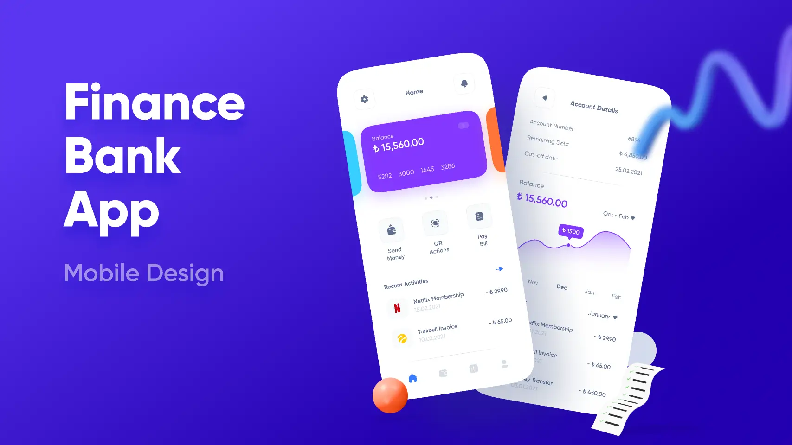

## Table of Contents
1. [Overview](#overview)
2. [Role](#role)
3. [Problem](#problem)
4. [Goal](#goal)
5. [Solution](#solution)
- [How do users manage finances currently?](#how-do-users-manage-finances-currently)
- [What features do users value most?](#what-features-do-users-value-most)
- [Exploring new financial management tools](#exploring-new-financial-management-tools)
- [User Journey](#user-journey)
6. [User Testing](#user-testing)
7. [Challenges and Learnings](#challenges-and-learnings)
8. [Final Thoughts](#final-thoughts)

---

## Overview
 Clínica UPQROO es una plataforma web diseñada para facilitar la gestión de citas médicas y proporcionar contenido informativo en salud. Construida con C#, HTML, CSS y JavaScript, permite a los pacientes conocer los servicios médicos disponibles, reservar citas en línea y acceder a artículos sobre salud y bienestar.

La plataforma optimiza la administración de citas, mejorando la accesibilidad y comunicación entre pacientes y médicos.
---

## 👨‍💻 Role
**Desarrollador Principal y Diseñador de UI/UX**

---

## ❓ Problem
Los pacientes y médicos de la clínica enfrentaban los siguientes problemas:

1 Dificultad para gestionar las citas médicas de manera eficiente.
2 Falta de un sistema centralizado para brindar información sobre los servicios médicos.
3 Ausencia de una plataforma para compartir contenido educativo sobre salud.

---

## 🎯 Goal
1 Crear un sitio web funcional y accesible para la gestión de citas médicas.
2 Implementar un formulario de contacto para mejorar la comunicación con los pacientes.
3 Desarrollar una sección de blog para compartir información médica confiable.

---

## ✨ Solution

Tras encuestar a 30 pacientes y 10 médicos, encontramos que:

60% de los pacientes experimentaban tiempos de espera prolongados debido a citas mal organizadas.
30% de los pacientes cancelaban sus consultas por falta de recordatorios.
80% de los médicos deseaban un sistema más eficiente para gestionar horarios.
Key Features Users Need
Los usuarios consideraron esenciales las siguientes funcionalidades:

Reserva y gestión de citas en línea.
Notificaciones automáticas para recordatorios de citas.
Sección de información médica confiable.
Development Process
Backend: Implementado con C# para manejar la gestión de citas y la base de datos.
Frontend: Construido con HTML, CSS y JavaScript para una experiencia fluida.
Interactividad: Formularios dinámicos con validación en tiempo real.
Seguridad: Implementación de cifrado para proteger datos sensibles de los pacientes.

---

### User Journey
1 Inicio: Presentación de la clínica y acceso a los servicios.
2 Servicios Médicos: Información detallada sobre especialidades disponibles.
3 Gestión de Citas: Interfaz intuitiva para reservar, modificar y cancelar citas.
4 Blog de Salud: Publicaciones organizadas por temas de interés médico.

---

## 🧪 User Testing
Probamos la plataforma con 20 pacientes y 5 médicos, obteniendo los siguientes resultados:

Accesibilidad: 90% de los usuarios encontraron la navegación intuitiva.
Gestión de Citas: Reducción del 50% en cancelaciones gracias a los recordatorios.
Interacción con el Blog: 75% de los usuarios valoraron la sección educativa y sugirieron incluir una función de búsqueda.

---

## ⚙️ Challenges and Learnings
Manejo de Datos Sensibles: Se implementaron medidas de seguridad para proteger la información médica.
Optimización de la Interfaz: Ajustes en el diseño para mejorar la experiencia en dispositivos móviles.
Automatización de Recordatorios: Notificaciones vía correo y SMS para reducir ausencias en citas.
---

## ✨ Final Thoughts
Seguridad de la Información: Es fundamental garantizar la privacidad de los datos médicos.
Diseño Iterativo: La retroalimentación constante de usuarios ayudó a mejorar la plataforma.
Expansión Futura: Se planea integrar videoconsultas y un sistema de recetas electrónicas.
---
